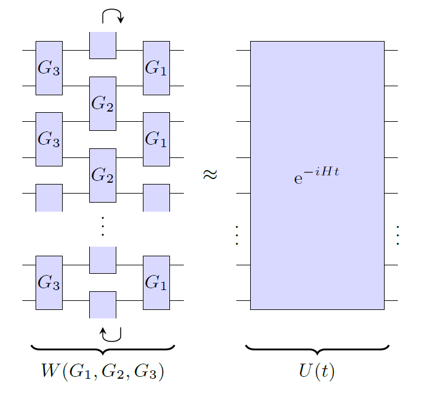

Riemannian quantum circuit optimization
=======================================

.. image:: https://github.com/qc-tum/rqcopt/actions/workflows/ci.yml/badge.svg?branch=master
  :target: https://github.com/qc-tum/rqcopt/actions/workflows/ci.yml

Python package to perform Riemannian quantum circuit optimization for Hamiltonian simulation, accompanying `arXiv:2212.07556 <https://arxiv.org/abs/2212.07556>`_.

Installation
------------
To install *rqcopt* from PyPI, call

.. code-block:: python

    python3 -m pip install rqcopt

Alternatively, you can clone this repository and install it in development mode via

.. code-block:: python

    python3 -m pip install -e <path/to/repo>
